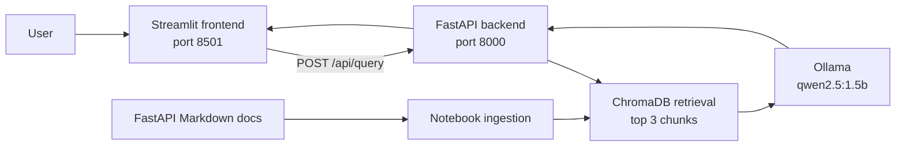
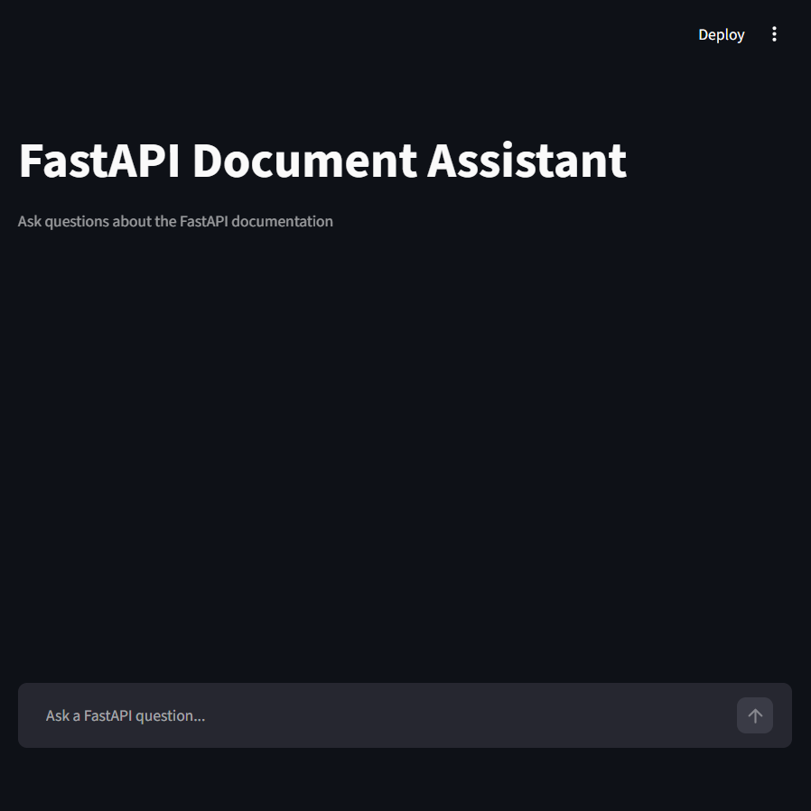

# RAG-Powered FastAPI Document Assistant

A local Retrieval-Augmented Generation assistant for the official FastAPI documentation. Ask a technical question in the Streamlit UI, retrieve relevant documentation chunks from ChromaDB, and receive a cited answer generated by a local Ollama model.

## Overview

The project uses FastAPI documentation in Markdown as its corpus. The pipeline loads the documents, splits them into overlapping 500-character chunks, embeds them with `all-MiniLM-L6-v2`, stores them in ChromaDB, retrieves the top three chunks, and asks Ollama's `qwen2.5:1.5b` model for a grounded explanation.

The model is instructed to explain in plain text and is not allowed to provide generated code. If a retrieved source contains a fenced code block, the application appends that block verbatim from the source. If no source code block exists, the answer contains no code.

## Architecture



## Tech Stack

| Component | Choice |
|---|---|
| Corpus | Official FastAPI documentation in Markdown |
| Chunking | Fixed 500 characters with 80-character overlap |
| Embeddings | `sentence-transformers/all-MiniLM-L6-v2` |
| Vector database | ChromaDB PersistentClient, cosine similarity |
| LLM | Ollama `qwen2.5:1.5b` |
| Backend | FastAPI + Uvicorn |
| Frontend | Streamlit |
| Tests | Pytest + FastAPI TestClient |

## Project Structure

```text
rag-documents-assistant/
├── backend/
│   ├── app/
│   │   ├── api/routes/query.py
│   │   ├── core/config.py
│   │   ├── schemas/query.py
│   │   ├── services/
│   │   │   ├── generation.py
│   │   │   └── retrieval.py
│   │   ├── utils/logging_config.py
│   │   └── main.py
│   ├── data/vector_store/       # Generated locally; ignored by Git
│   ├── tests/test_query.py
│   ├── Dockerfile
│   ├── requirements.txt
│   └── .env.example
├── data/
│   └── raw_docs/               # FastAPI Markdown corpus (14 documents)
├── frontend/
│   ├── app.py
│   ├── api_client.py
│   ├── requirements.txt
│   └── .env.example
├── notebooks/
│   ├── rag_pipeline.ipynb      # Main RAG development & ingestion pipeline
│   └── evaluation_results.csv  # 10-query benchmark metrics
├── docs/
│   ├── PROJECT_REPORT.md       # Comprehensive graduation project submission report
│   ├── Graduation_Project_L2.pdf # Project requirements specification
│   └── screenshots/streamlit-home.png
├── .gitignore
└── README.md
```

## Data and Domain

The domain is English FastAPI official documentation. The corpus covers first steps, path and query parameters, request bodies, dependencies and sub-dependencies, middleware, CORS, background tasks, responses, and OAuth2 security. The Markdown files are stored in `data/raw_docs/` and are UTF-8 encoded.

The ChromaDB vector store is generated by the notebook and is intentionally excluded from Git. Rebuild it by running the ingestion and embedding cells in `notebooks/rag_pipeline.ipynb`.

## Prerequisites

- Python 3.12
- Ollama installed and running
- Ollama model `qwen2.5:1.5b`
- A few GB of free disk space for Python/model caches

Start Ollama in a separate terminal:

```powershell
ollama serve
ollama pull qwen2.5:1.5b
```

Create the virtual environment from the project root:

```powershell
python -m venv .venv
.\.venv\Scripts\Activate.ps1
```

## Backend Setup

Install backend dependencies:

```powershell
python -m pip install -r backend/requirements.txt
```

The backend defaults are in `backend/.env.example`. Copy it to `backend/.env` if you need to override settings.

Start the API from the project root:

```powershell
$env:PYTHONPATH = (Resolve-Path .\backend).Path
python -m uvicorn app.main:app --app-dir backend --host 127.0.0.1 --port 8000
```

The API starts at `http://127.0.0.1:8000`. Swagger UI is available at `http://127.0.0.1:8000/docs`.

## Frontend Setup

Install frontend dependencies:

```powershell
python -m pip install -r frontend/requirements.txt
```

Create the local environment file:

```powershell
Copy-Item frontend/.env.example frontend/.env
```

`frontend/.env` must contain:

```text
API_BASE_URL=http://127.0.0.1:8000
```

Start Streamlit from the project root:

```powershell
python -m streamlit run frontend/app.py --server.port 8501
```

Open `http://localhost:8501`.

## Environment Variables

| File | Variable | Default | Purpose |
|---|---|---|---|
| `backend/.env` | `OLLAMA_HOST` | `http://127.0.0.1:11434` | Ollama server URL |
| `backend/.env` | `OLLAMA_MODEL` | `qwen2.5:1.5b` | Local generation model |
| `backend/.env` | `COLLECTION_NAME` | `fastapi_docs` | Chroma collection |
| `backend/.env` | `EMBEDDING_MODEL_NAME` | `all-MiniLM-L6-v2` | Embedding model |
| `frontend/.env` | `API_BASE_URL` | `http://127.0.0.1:8000` | Backend base URL |

Do not commit `.env` files. They are ignored by `.gitignore`.

## API Reference

### `GET /health`

Returns:

```json
{"status":"ok","service":"RAG Document Assistant Backend"}
```

### `POST /api/query`

Request:

```json
{"question":"How can I handle CORS in FastAPI?"}
```

Response:

```json
{"answer":"...","sources":["tutorial_cors.md"]}
```

Example:

```powershell
curl.exe -X POST http://127.0.0.1:8000/api/query `
  -H "Content-Type: application/json" `
  -d '{"question":"How can I handle CORS in FastAPI?"}'
```

The unversioned `/query` and versioned `/api/query` routes are both available. CORS allows the default Streamlit origin `http://localhost:8501`.

## Evaluation

The latest code-safe evaluation is stored in `notebooks/evaluation_results.csv`. The preserved previous run is stored in `notebooks/evaluation_results_baseline_1.5b_fallback.csv`.

| Run | Correct | Grounded | Code extracted |
|---|---:|---:|---:|
| 1.5B model with broad excerpt fallback | 5/10 | 10/10 | Not measured |
| Text-only generation with verbatim fenced-code extraction | 3/10 | 4/10 | 0/10 |

The lower second score is intentional: model-generated code is rejected, and the current raw Markdown corpus uses source include references such as `{* ../../docs_src/cors/tutorial001_py310.py *}` instead of embedding those Python files as fenced blocks. When no fenced block is present in retrieved chunks, the system returns the supported explanation without adding code. It never invents a replacement example.

Run backend tests:

```powershell
$env:PYTHONPATH = (Resolve-Path .\backend).Path
python -m pytest backend/tests/ -v
```

Expected result: all tests pass, including unsupported-answer refusal and verbatim source-code extraction tests.

## Stranger Verification

To verify the project from a clean copy:

1. Clone the repository into a new empty folder.
2. Install Python 3.12 and Ollama.
3. Pull `qwen2.5:1.5b`.
4. Create and activate `.venv`.
5. Install both requirements files.
6. Ensure the generated vector store exists, or run the notebook ingestion/embedding cells.
7. Start Ollama, backend, and frontend using the commands above.
8. Open `/docs`, call `/health`, then ask a question in Streamlit.
9. Stop Ollama or the backend and confirm the UI shows a friendly connection error instead of a traceback.

The vector store is ignored by Git because it is generated data. A fresh clone therefore needs the notebook build step before the backend can retrieve documents.

## Screenshots

The running Streamlit interface:



For the final presentation, also capture:

- Streamlit chat with a generated explanation and Sources section.
- Streamlit chat showing the friendly backend-unavailable error.
- FastAPI Swagger UI showing `/health` and `/api/query`.

Store additional presentation images under `docs/screenshots/`.
