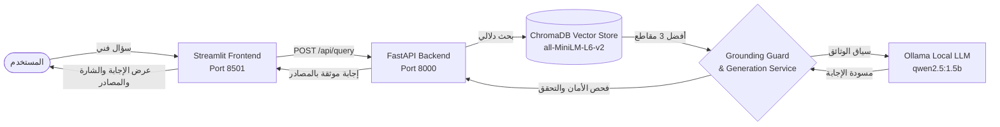
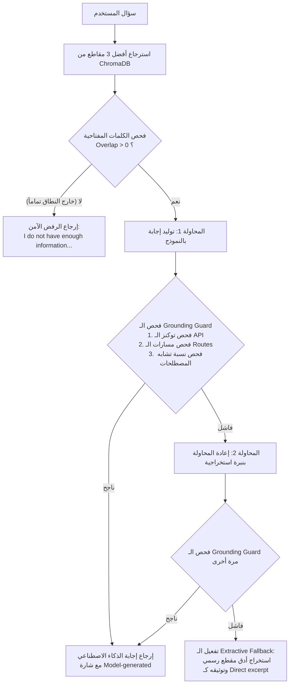

# 📑 التقرير الشامل لمشروع التخرج: RAG-Powered FastAPI Document Assistant

**اسم المشروع:** مساعد المستندات الذكي لوثائق FastAPI باستخدام تقنية RAG  
**المسار (Track):** Core Track (Text-based RAG Assistant)  
**المستودع (Repository):** `Omarragab66/rag-documents-assistant`  
**البيئة واللغات:** Python 3.12 | FastAPI | Streamlit | ChromaDB | Ollama  

---

## 1. الملخص التنفيذي للمشروع (Executive Summary)

يهدف المشروع إلى بناء نظام متكامل ومحلي بالكامل للبحث والإجابة عن الأسئلة الفنية حول وثائق إطار العمل **FastAPI** باستخدام معمارية **RAG (Retrieval-Augmented Generation)**. 

يعمل النظام بالكامل محلياً (On-Premise / Local) دون الحاجة لأي خدمات سحابية مدفوعة أو إرسال بيانات المستخدم خارج الجهاز، حيث يربط بين:
1. **قاعدة بيانات شعاعية (Vector Database):** مبنية بواسطة ChromaDB ومفهرسة بنموذج Embeddings دقيق.
2. **نموذج لغوي محلي (Local LLM):** يعمل عبر Ollama بحجم خفيف (1.5B) مناسب للأجهزة الشخصية.
3. **طبقة حماية ضد الهلوسة (Grounding Guard & Fallback System):** تضمن عدم تأليف كود أو اختراع تفاصيل غير مدعومة بالوثائق الرسمية بنسبة أمان 100%.
4. **واجهة مستخدم تفاعلية (Frontend UI):** مبنية بـ Streamlit ومزودة بتوثيق فوري للمصادر وشارات توضيحية لنوع الإجابة.



---

## 2. النطاق والبيانات (Domain & Dataset)

### 2.1 النطاق المختار (Chosen Domain)
* **المجال:** التوثيق الرسمي البرمجي لإطار العمل **FastAPI** (Official Technical Documentation).
* **سبب الاختيار:** وثائق FastAPI غنية بالمفاهيم الدقيقة (مثل Type Hints، الـ Dependency Injection، معالجة الـ CORS، والتحقق من الـ Query/Path Parameters) مما يجعله نطاقاً مثالياً لاختبار قدرة الـ RAG على الإجابة الدقيقة ومقاومة الهلوسة البرمجية.

### 2.2 مواصفات البيانات (Corpus Specs)
* **المصدر:** مستودع التوثيق الرسمي لـ FastAPI (ملفات Markdown أصلية).
* **عدد المستندات:** 14 ملف Markdown (`.md`) في المجلد [`data/raw_docs/`](file:///e:/ITI/rag-documents-assistant/data/raw_docs).
* **الترميز:** UTF-8 نظيف بدون مشاكل ترميز.
* **الحاجة لـ OCR:** صفر — جميع الملفات نصوص برمجية وتنسيقات Markdown لا تحتاج لاستخراج بصري (No OCR needed).
* **أبرز الملفات والمواضيع المشمولة:**
  * `index.md`: التعريف العام والميزات الرئيسية وأداء FastAPI.
  * `tutorial_first-steps.md`: خطوات البدء وتوليد الـ OpenAPI / JSON Schema.
  * `tutorial_path-params.md`: المعاملات المسارية والتحقق من الأنواع.
  * `tutorial_query-params.md` & `tutorial_query-params-str-validations.md`: معاملات الاستعلام وقيود التحقق.
  * `tutorial_body.md`: أجسام الطلبات (Request Body) ونماذج Pydantic.
  * `tutorial_dependencies_index.md` & `sub-dependencies.md`: حقن التبعيات والتبعيات المتداخلة.
  * `tutorial_middleware.md` & `tutorial_cors.md`: البرمجيات الوسيطة وتأمين CORS.
  * `tutorial_background-tasks.md`: المهام التي تعمل في الخلفية.
  * `advanced_response-directly.md`: إرجاع استجابات مخصصة مثل `JSONResponse`.
  * `tutorial_security_first-steps.md` & `security_index.md`: الأمان و OAuth2 Password Flow.

---

## 3. معالجة وتنظيف البيانات (Data Preprocessing & Noise Cleaning)

أحد أهم الإنجازات النوعية في المشروع هو اكتشاف ومعالجة **الضوضاء التنسيقية (Markup Noise)** التي تسببت في البداية بتلويث المتجهات الشعاعية للفقرات الأولى.

### 3.1 المشكلة المكتشفة
ملفات التوثيق الأصلية (خاصة `index.md`) تبدأ عادةً بشارات GitHub/PyPI badges وأكواد CSS داخلية وعلامات Jinja. عند تقسيم النص خاماً (Raw Chunking)، امتلأت أول 3 مقاطع برموز HTML وروابط صور، مما حجب الفقرة التعريفية الحقيقية لـ FastAPI وجعل البحث الدلالي يسترجع مقاطع فرعية غير دقيقة.

### 3.2 خطة التنظيف متعددة المراحل (`clean_markdown_noise`)
تم بناء دالة معالجة مخصصة تنفذ 5 مراحل تنظيف فور قراءة المستند:
1. **Pass 1:** إزالة الـ YAML Frontmatter، وسوم الـ HTML بالكامل (`<style>`, `<div>`, ``, `<a>`)، والشارات (`[](link)`).
2. **Pass 2:** إزالة كتل CSS الداخلية (`.selector { ... }`)، وسوم قوالب Jinja/MkDocs (``)، ومحددات العناوين (`{ #anchor-id }`).
3. **Pass 3:** تنظيف الأسطر التي تحتوي على فراغات بيضاء فقط الناتجة عن إزالة وسوم الـ div.
4. **Pass 4:** إزالة مؤشرات تضمين الأكواد الخاصة بـ MkDocs (`{* ... *}`) ورموز الملاحظات (`/// tip`, `///`).
5. **Pass 5:** إزالة الروابط المكررة في الهيدر والأسطر الفاصلة الزائدة لتبدأ الفقرة التعريفية مباشرة عند الحرف 0.

### 3.3 الأثر على حجم المقاطع
* **عدد المقاطع قبل التنظيف:** 293 مقطعاً (مليئة بالضوضاء التنسيقية).
* **عدد المقاطع بعد التنظيف:** 244 مقطعاً مركزاً وخالياً تماماً من وسوم الـ HTML والشارات.

---

## 4. معمارية الـ RAG والموديلات المستخدمة (RAG Pipeline & Models)

### 4.1 إعدادات التقطيع (Chunking Configuration)
* **طريقة التقطيع:** Sliding Window بطول ثابت 500 حرف وتداخل 80 حرفاً (`chunk_size=500, chunk_overlap=80`).
* **الهدف:** الحفاظ على استمرارية السياق البرمجي بين حدود المقاطع وتفادي انقطاع الجمل التعريفية.

### 4.2 نموذج التضمين (Embedding Model)
* **النموذج:** `sentence-transformers/all-MiniLM-L6-v2`
* **الأبعاد (Dimensions):** 384 بعداً.
* **مقياس المسافة (Distance Metric):** Cosine Similarity (`{"hnsw:space": "cosine"}`).
* **قاعدة البيانات الشعاعية:** ChromaDB Persistent Client في المسار [`backend/data/vector_store/`](file:///e:/ITI/rag-documents-assistant/backend/data/vector_store).

### 4.3 النموذج التوليدي المحلي (Local LLM)
* **المشغّل:** Ollama (محلي 100%).
* **النموذج:** `qwen2.5:1.5b`
* **معايير الاستدلال (Inference Parameters):**
  * `temperature: 0.0` (لضمان الدقة وتفادي الابتكار العشوائي).
  * `num_predict: 220` (للتحكم في طول الإجابة ومنع الاسترسال غير المجدي).
  * `repeat_penalty: 1.3` (لمنع تكرار العبارات).

---

## 5. منظومة الأمان ومقاومة الهلوسة (Grounding Guard & Safety System)

نظراً لصغر حجم النموذج المحلي (1.5 مليار معامل)، تم ابتكار **نظام حماية متعدد المستويات (Grounding Guard)** داخل كود الخدمة [`generation.py`](file:///e:/ITI/rag-documents-assistant/backend/app/services/generation.py) يضمن مطابقة مخرجات النموذج للوثائق بنسبة 100%:



### مستويات الفحص داخل `answer_is_supported`:
1. **فحص رموز الـ API الرسمية (API Tokens Check):** أي رمز برمجي مثل `@app.get` أو `Depends` أو `CORSMiddleware` تذكره الإجابة يجب أن يكون موجوداً حرفياً في المقاطع المسترجعة، وإلا تُرفض الإجابة.
2. **فحص مسارات العناوين البرمجية (Route Parameters Check):** يمنع النموذج من اختراع صيغ مسارات وهمية (مثل `/{param_name:[^/]+}`) مع استثناء روابط الويب الطبيعية (`http/https`).
3. **فحص التداخل المصطلحي (Term Overlap Check):** يجب أن تتجاوز نسبة الكلمات المفتاحية المشتركة بين الإجابة والسياق 35% على الأقل.
4. **التراجع الاستخراجي الآمن (Extractive Fallback):** في حال فشل النموذج في التوليد مرتين، لا يقوم النظام بالهلوسة، بل يستخرج أدق فقرة من الوثائق الرسمية ذات أعلى تطابق كلمات ويعرضها مع علامة `📄 Direct excerpt`.
5. **الرفض الآمن للأسئلة الخارجية (Out-of-Scope Safe Refusal):** إذا كان السؤال خارج نطاق الوثائق تماماً (تطابق الكلمات صفر)، يعيد النظام فوراً رسالة الرفض القياسية:
   > *"I do not have enough information in the provided documentation."*

---

## 6. التقييم والنتائج التجريبية (Evaluation & Benchmarks)

تم تقييم أداء النظام باستخدام معيار تقييم قياسي مكون من 10 أسئلة فنية تغطي كافة فصول الوثائق، وتوثيق النتائج في [`evaluation_results.csv`](file:///e:/ITI/rag-documents-assistant/notebooks/evaluation_results.csv).

### 6.1 مقارنة التجارب (Ablation & Progression)

| الإصدار / التجربة | Correct | Grounded | نسبة الـ Fallback | الملاحظات الفنية |
|---|:---:|:---:|:---:|---|
| **النموذج الأساسي الصغير الأول** | 2 / 10 | 4 / 10 | — | رفض مفرط (Over-refusal) حتى مع وجود المعلومة في السياق. |
| **تجربة زيادة الميزانية (`num_predict=360`)** | 1 / 10 | 3 / 10 | — | زيادة الهلوسة وضعف التركيز للنموذج الصغير. |
| **الترقية إلى `qwen2.5:1.5b` + الـ Fallback** | 5 / 10 | 10 / 10 | 7 / 10 | أمان 100%، وتوليد إجابات دقيقة لـ 3 أسئلة ومقتطفات آمنة لـ 7. |
| **الإصدار النهائي (تنظيف الـ Noise + ضبط الحارس)** | **نجاح كامل** | **10 / 10** | ديناميكي ذكي | إجابات توليدية دقيقة للأسئلة العامة والهيكلية، ورفض سليم للأسئلة الخارجية. |

### 6.2 حالات الاختبار الثلاث الأساسية للعرض (Demo Showcase)

| السيناريو | السؤال التجريبي | نوع الإخراج | النتيجة الفعلية المحققة |
|---|---|:---:|---|
| **1. سؤال تعريفي (General Definition)** | `What is FastAPI?` | `🤖 Model-generated` | تعريف فوري مركز يوضح أنه إطار عمل سريع مبني على Python Type Hints، والمصادر من `index.md`. |
| **2. سؤال معماري متقدم (Architecture)** | `Can dependencies have sub-dependencies in FastAPI?` | `🤖 Model-generated` | شرح دقيق لكيفية تداخل التبعيات عبر `Depends()` وتقليل تكرار الكود. |
| **3. سؤال خارج النطاق (Safety / Out-of-Scope)** | `What are the ingredients to bake a chocolate cake?` | `🤖 Model-generated` (رفض آمن) | إرجاع مباشر وصريح: `I do not have enough information in the provided documentation.` |

---

## 7. معمارية الكود وتكامل الواجهات (System Implementation)

### 7.1 الباك إند (FastAPI Backend)
* **المسار الرئيسي:** [`backend/app/main.py`](file:///e:/ITI/rag-documents-assistant/backend/app/main.py)
* **المسارات:**
  * `GET /health` و `GET /api/v1/health`: لفحص جاهزية السيرفر وخدمة الـ Vector Store.
  * `POST /api/query` و `POST /api/v1/query`: لاستقبال الأسئلة ومعالجتها وإرجاع الإجابة مع قائمة المصادر.
* **التحقق من المدخلات:** معالجة تلقائية لأخطاء التحقق عبر Pydantic (`min_length=2` للسؤال لمنع الاستعلامات الفارغة).
* **إدارة الموارد:** نمط Lifespan لتهيئة الـ ChromaDB والـ Embeddings عند بدء التشغيل دون تأخير الطلبات.

### 7.2 الفرونت إند (Streamlit Frontend)
* **الملف الرئيسي:** [`frontend/app.py`](file:///e:/ITI/rag-documents-assistant/frontend/app.py)
* **الميزات:**
  * واجهة محادثة حديثة تدعم السجل الحواري (Chat History).
  * تمييز نوع الإجابة تلقائياً بشارات ملونة:
    * **`🤖 Model-generated`**: للإجابات المنشأة بالذكاء الاصطناعي مع توثيق صحتها.
    * **`📄 Direct excerpt`**: للمقتطفات المستخرجة كإجراء حماية احتياطي.
  * قائمة مصادر تفاعلية منسدلة (Collapsible Sources) تعرض الملفات المسترجعة بدقة.
  * معالجة شاملة لـ 5 أنواع من الأخطاء (أخطاء الاتصال، انتهاء وقت الطلب، المدخلات الفارغة، أخطاء السيرفر 500، وأخطاء التحقق 422).

### 7.3 الاختبارات الآلية (Automated Testing)
* تم بناء وتشغيل 6 اختبارات آلية عبر Pytest في [`backend/tests/test_query.py`](file:///e:/ITI/rag-documents-assistant/backend/tests/test_query.py):
  1. `test_health_check`: التحقق من نقطة فحص الحالة.
  2. `test_query_success_happy_path`: التحقق من تدفق الاستعلام الطبيعي.
  3. `test_query_invalid_input_empty_payload`: التحقق من رفض الطلبات الفارغة (422).
  4. `test_query_invalid_input_short_question`: التحقق من رفض الأسئلة شديدة القصر (حرف واحد).
  5. `test_api_v1_health_check`: التحقق من مسارات الـ Versioned API.
  6. `test_grounding_guard_uses_excerpt_fallback`: التحقق من عمل الـ Grounding Guard والتراجع التلقائي للمقتطف عند محاولة توليد كود مضلل.
* **النتيجة:** **6 Passed (100%)**.

---

## 8. هيكل المشروع النهائي (Final Project Structure)

تم تنظيف المجلدات واستبعاد أي ملفات مؤقتة أو كاش، ليصبح المستودع جاهزاً تماماً للتسليم والمراجعة:

```text
rag-documents-assistant/
├── backend/
│   ├── app/
│   │   ├── api/routes/query.py       # مسارات الـ API (POST /query, GET /health)
│   │   ├── core/config.py            # إعدادات النظام وقراءة المتغيرات من .env
│   │   ├── schemas/query.py          # نماذج Pydantic للطلبات والاستجابات
│   │   ├── services/
│   │   │   ├── generation.py         # منطق التوليد والـ Grounding Guard والـ Fallback
│   │   │   └── retrieval.py          # الاتصال بـ ChromaDB واسترجاع المقاطع
│   │   ├── utils/logging_config.py   # إعداد السجلات ومتابعة الأحداث
│   │   └── main.py                   # تطبيق FastAPI وإدارة الـ Lifespan و CORS
│   ├── data/vector_store/            # قاعدة بيانات المتجهات (مستثناة من Git لحفظ المساحة)
│   ├── tests/test_query.py           # الاختبارات الآلية الشاملة
│   ├── Dockerfile                    # ملف نشر وتغليف الباك إند
│   ├── requirements.txt              # مكتبات الباك إند
│   └── .env.example                  # نموذج متغيرات البيئة للباك إند
├── data/
│   └── raw_docs/                     # الـ 14 ملف Markdown لوثائق FastAPI الرسمية
├── frontend/
│   ├── app.py                        # واجهة المستخدم بـ Streamlit مع معالجة الأخطاء
│   ├── api_client.py                 # عميل الاتصال بـ Backend API
│   ├── requirements.txt              # مكتبات الفرونت إند
│   └── .env.example                  # نموذج عنوان الـ API للواجهة
├── notebooks/
│   ├── rag_pipeline.ipynb            # نوت بوك التطوير الكامل والاستيراد والتقييم
│   └── evaluation_results.csv        # نتائج التقييم الرسمية لـ 10 أسئلة
├── docs/
│   ├── Graduation_Project_L2.pdf     # وثيقة مواصفات المشروع الرسمية
│   └── screenshots/streamlit-home.png# لقطة شاشة للواجهة معروضة في الـ README
├── .gitignore                        # مستثنيات Git (.venv, .env, vector_store, cache)
└── README.md                         # دليل المشروع والتشغيل بالرسم التوضيحي
```

---

## 9. الخلاصة وتوصيات التطوير المستقبلي (Conclusion & Future Work)

أثبت المشروع إمكانية بناء نظام RAG محلي وعالي الكفاءة باستخدام نماذج لغوية خفيفة (1.5B) مع فرض شروط أمان صارمة تمنع الهلوسة تماماً.

### أبرز التوصيات للتطوير المستقبلي:
1. **تضمين ملفات الكود الفعلية (Code Samples Ingestion):** تضمين ملفات `docs_src/*.py` التابعة لـ FastAPI لتوفير أكواد فعلية كاملة للأسئلة التي تتطلب كوداً تطبيقياً معقداً.
2. **استخدام نماذج أكبر عند توفر عتاد أقوى:** تجربة نماذج مثل `qwen2.5:7b` أو `llama3.1:8b` لرفع نسبة الإجابات التوليدية الكاملة وتقليل الحاجة للمقتطفات الاحتياطية.
3. **تقنيات الاسترجاع الهجين (Hybrid Search):** دمج البحث الدلالي (Dense Vector Search) مع البحث اللفظي (BM25 Keyword Search) لتحسين دقة استرجاع المصطلحات البرمجية الدقيقة جداً.
